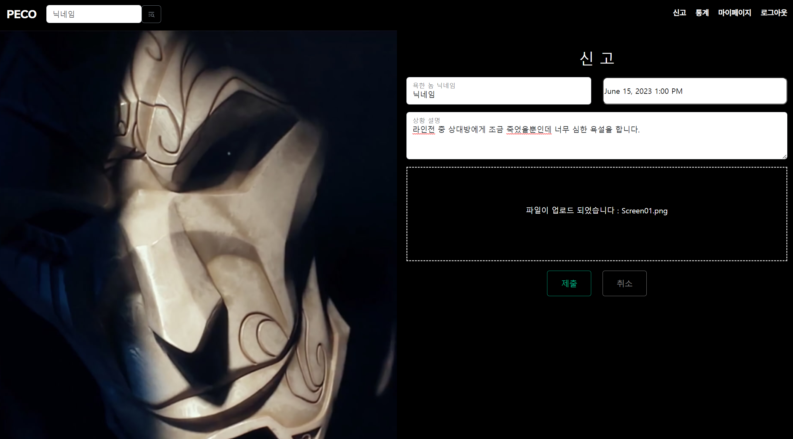
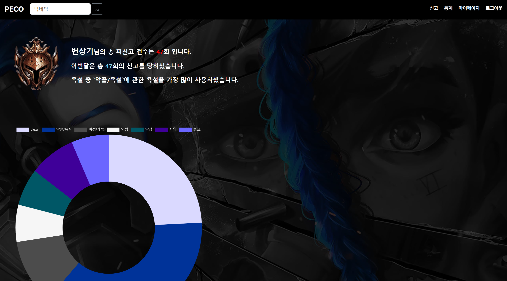
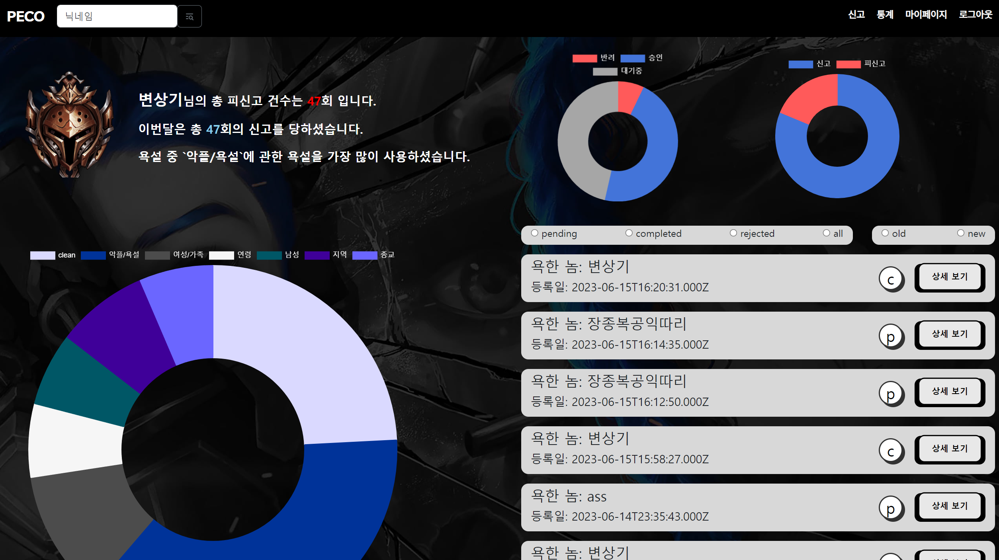
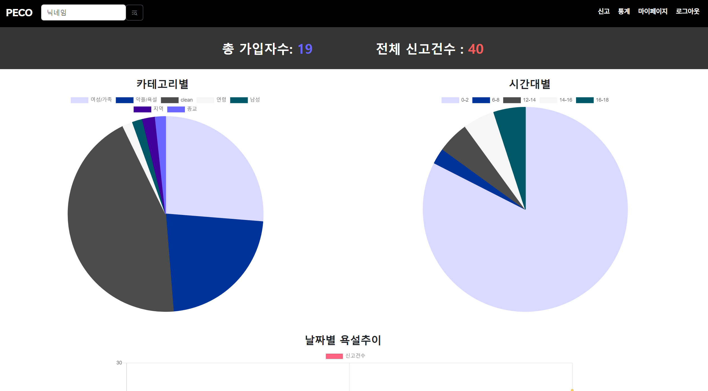
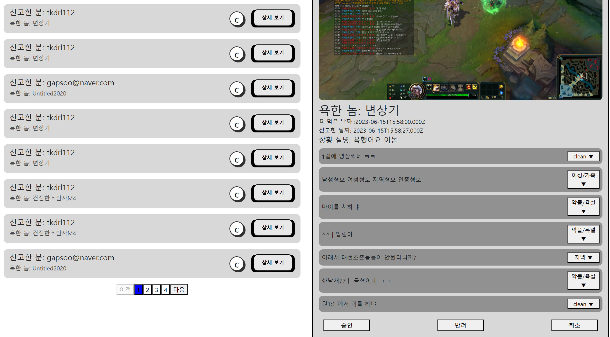
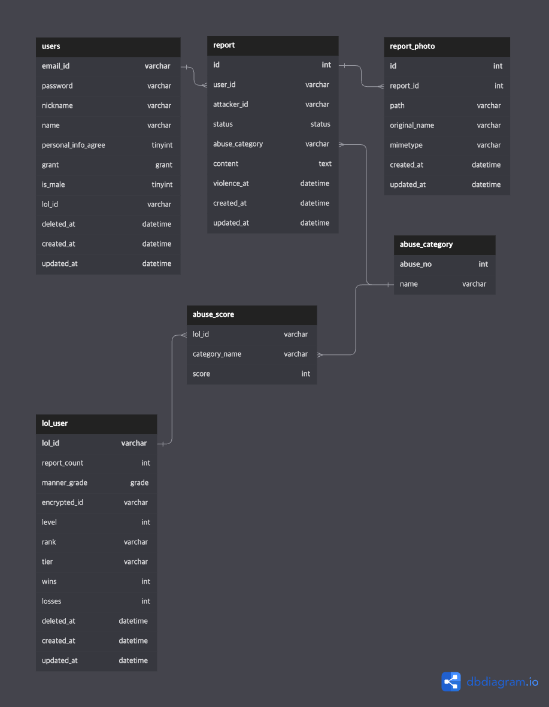

# PECO(Peaceful Community)
- 온라인 게임 상의 커뮤니티 환경 회복을 위한 욕설 전적 검색 서비스

## 1. 프로젝트 소개

  - 2021,2022년 한국지능정보사회진흥원_사이버폭력 실태조사 데이터 활용
  - 기술 스택
    - 프론트엔드 : Javascript(JScode), React, bootstrap
    - 백엔드 : JavaScript(express), Python(flask), MySQL
    - 데이터 분석: Python
    - 협업 : Figma, Git, Notion
    - 배포 : Amazon RDS

    - 온라인 게임 상에서의 욕설에 대한 제보, 검색, 통계 서비스를 제공하여 건강한 온라인 게임 상의 커뮤니티 문화를 조성 하기 위한 목적을 가진 서비스

## 2. 프로젝트 목표

  - 상세한 데이터 분석 자료는 /data_analysis 폴더에 있습니다.
  - 현대 사회에서 인간은 오프라인 환경만큼이나 온라인 환경에 노출되어 있습니다.
  하지만, 오프라인 환경과 마찬가지로 온라인 환경도 오염되어 있으며 이로 인해 피해를 입는 사람들이 존재합니다.
  '2021,2022 한국지능정보사회진흥원_사이버폭력 실태조사'에 따르면 사이버 폭력을 당한 경로는 온라인 게임이 가장 높게 나타났으며, 
  HoneyBee는 '온라인 게임에서의 욕설로 인한 커뮤니티 환경 저해 문제'를 해결하기 위해 
  사이버 언어폭력 가해자들을 제보하고 신고 할 수 있게 도와주는 사이트인 'PECO'를 제작하여 
  욕설 피해자들의 대응을 적극적으로 변화시키고, 온라인 상의 욕설 빈도를 완화시킬 웹사이트로 기대합니다.

## 3. 프로젝트 기능 설명

  | LoL 유저에 대한 욕설 제보  
  - 게임 플레이 도중 나온 욕설을 캡쳐 해 해당 사용자를 제보할 수 있습니다.
  

  | LoL 유저에 대한 욕설 정보 조회
  - 게임을 시작하기 전 다른 유저들의 욕설 이력을 검색 해 욕설로 인해 입을 피해를 방지할 수 있습니다.
  

  | 신고 및 피신고 이력 조회
  - 내가 당한 피해에 대한 제보는 어떻게 처리 되었는지, 또한 나는 얼마나 신고 당했는지를 같이 볼 수 있어 신고 피드백과 나의 커뮤니티 이용 습관을 볼 수 있습니다.
  

  | 통계
  - 우리 커뮤니티 이용자 또는 욕설 가해자들의 욕설 유형, 시간대 등 통계를 볼 수 있습니다.
  

  | 신고 처리
  - 커뮤니티 운영자는 사진을 제보 받아 문장별로 학습 모델이 분류한 카테고리를 받아 오류가 있으면 수정 후 제보 승인, 반려 여부를를 결정할 수 있습니다.
  

  
## 4. ERD
  

## 5. 프로젝트 팀원 역할 분담
| 이름 | 담당 업무 |
| ------ | ------ |
| 이승빈 | 팀장/프론트엔드 개발 |
| 유희조 | 백엔드 팀장/백엔드 개발/ 데이터 분석 |
| 변상기 | 백엔드 개발/ 데이터 분석 |
| 유승제 | 프론트엔드 개발/ 웹 디자인 |
| 탁은경 | 백엔드 개발 |
| 노충완 | 백엔드 개발 |

1. 팀장 

- 기획 단계: 구체적인 설계와 지표에 따른 프로젝트 제안서 작성
- 개발 단계: 팀원간의 일정 등 조율 + 프론트 or 백엔드 개발
- 수정 단계: 기획, 스크럼 진행, 회의를 통한 피드백을 반영하여 계획 수정, 발표 준비

2. 프론트엔드 

- 기획 단계: 큰 주제에서 문제 해결 아이디어 도출, 데이터 수집, 와이어프레임 작성
- 개발 단계: 와이어프레임을 기반으로 구현, 데이터 처리 및 시각화 담당, UI 디자인 완성
- 수정 단계: 피드백 반영해서 프론트 디자인 수정

 3. 백엔드 & 데이터 담당  

- 기획 단계: 기획 데이터 분석을 통해 해결하고자 하는 문제를 정의 및 API 계획
- 개발 단계: 웹 서버 사용자가 직접 백엔드에 저장할 수 있는 기능 구현, 데이터 베이스 설계 및 API 활용,
- 수정 단계: 그래프 시각화 방식 수정 및 버그 수정

## 4. FAQ
  - 피 신고자의 닉네임 변경 관련 - 라이엇 API 에서 제공하는 계정의 변하지 않는 고유 ID를 이용해 닉네임을 변경해도 기존 이력을 추적 가능하게 구현할 예정

