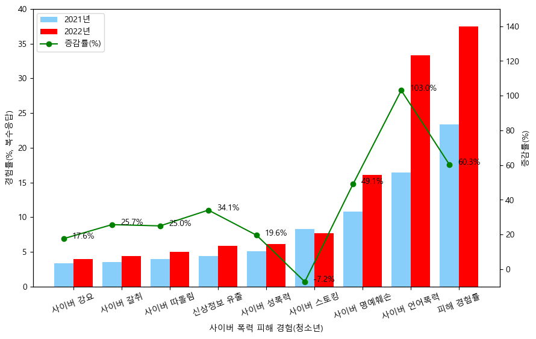
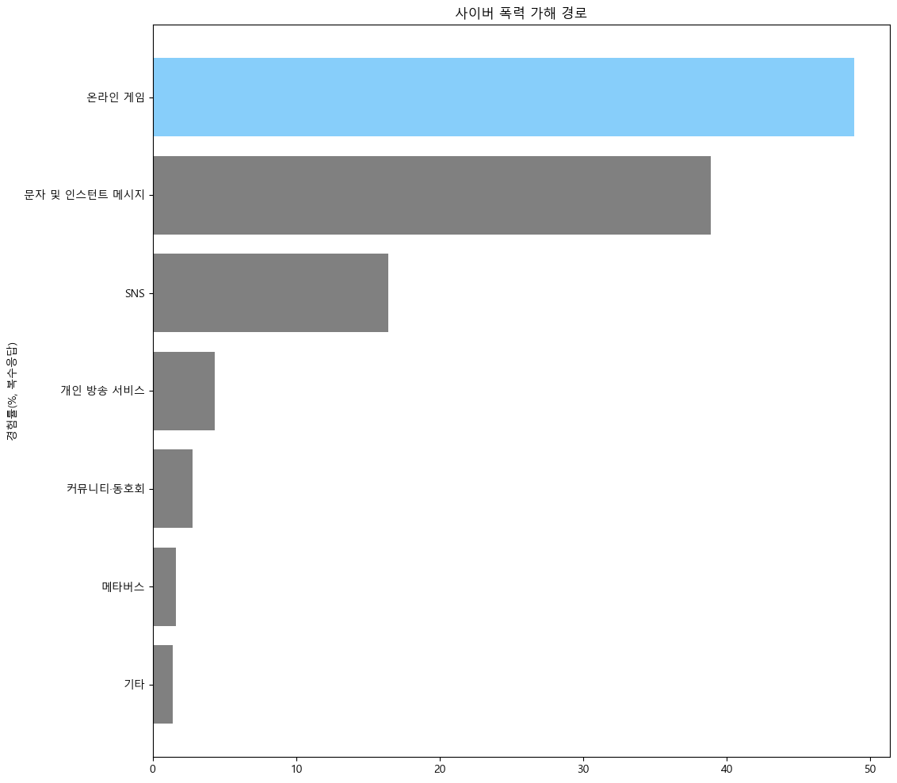
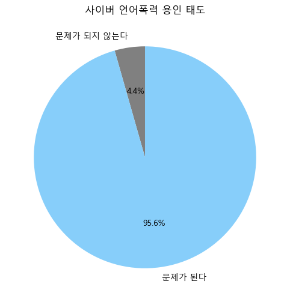
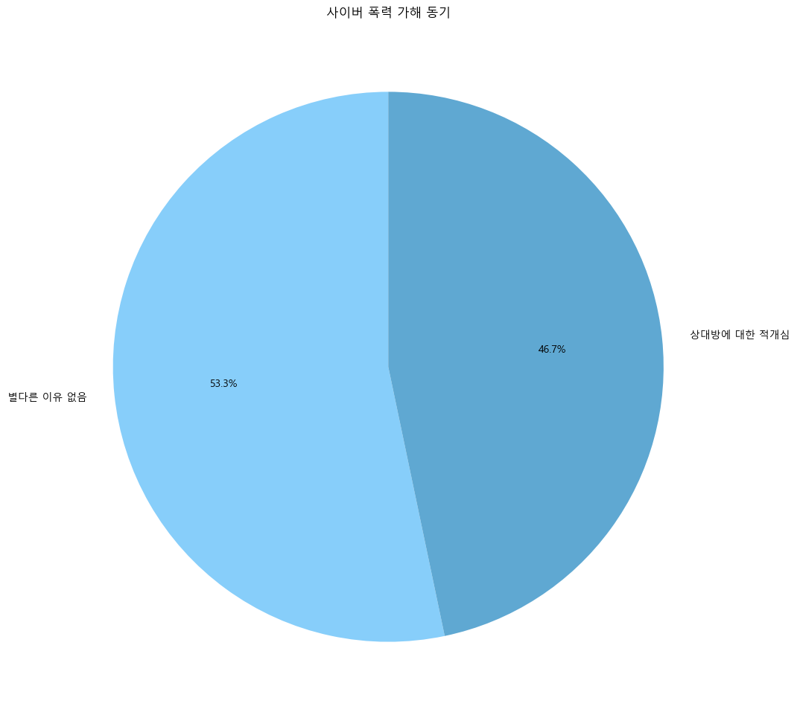
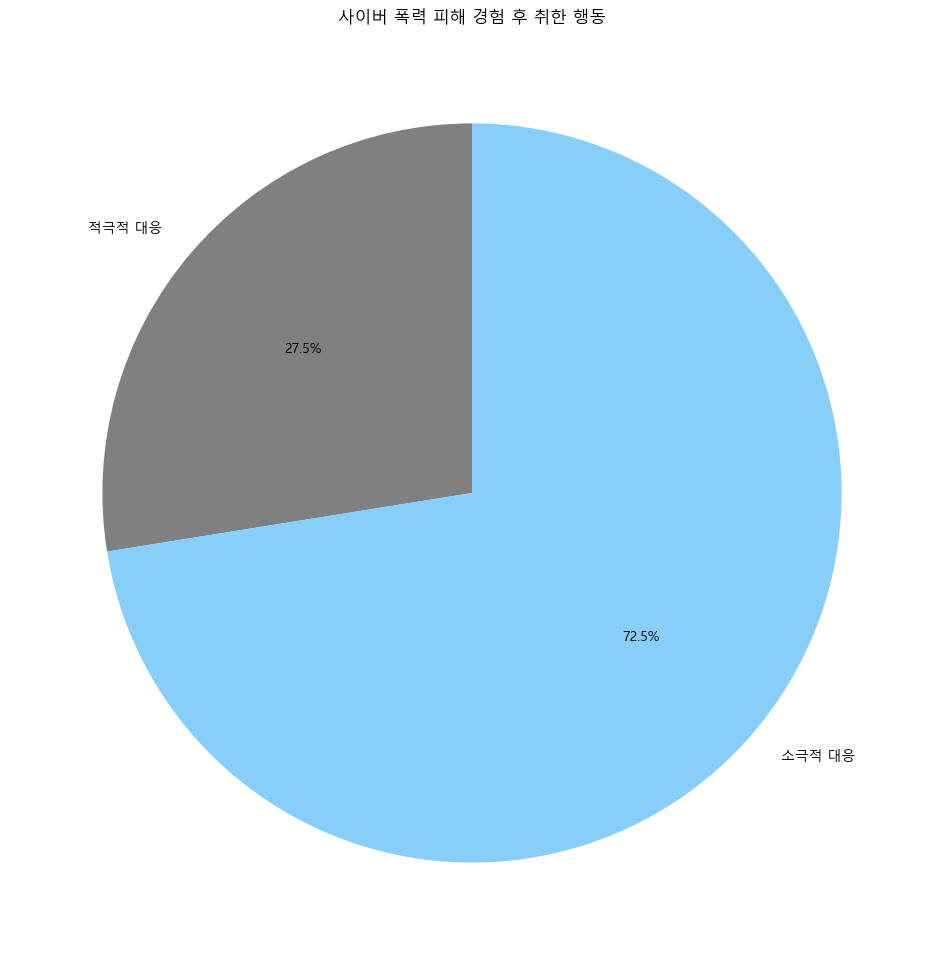
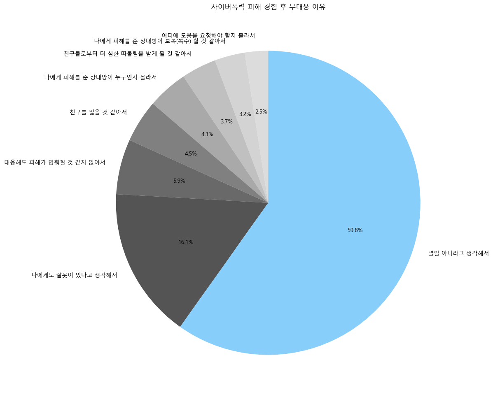

# PECO 관련 데이터 분석 결과 요약
>## 배경
|  |  |
| --- | --- |

> 현대 사회에서 인간은 물리적인 자연, 사회 환경에 노출되는 빈도만큼, 사이버 환경에도 노출되어 있다. 물리적인 환경이 그러하듯 사이버 환경도 여러 폭력으로 오염되어 있는 상황이다. 그 중 **사이버 언어 폭력**의 비율이 가장 높았으며, 특히 1년 사이에 크게 늘어난 것을 확인할 수 있다. 사이버 폭력 가해의 경로의 경우 **온라인 게임**이 가장 높게 나왔다.

|  |  |
| --- | --- |
| **상대방에 대한 적개심** | **별다른 이유 없음** |
| - 상대방이 먼저 그런 행동을 해서 보복하기 위해 | - 재미나 장난으로 스트레스 해소를 위해 |
| - 상대방이 싫어서 상대방에게 화가 나서 | - 그냥 특별한 이유 없이 |
| - 내 의견과 달라서 상대방이 틀린 말을 해서 | - 주변에서 함께 하므로 친구들과 어울리기 위해 |

>**사이버 언어폭력 용인 태도** 그래프에서 나타나듯이 사이버 언어 폭력에 대해서 대부분 문제가 된다고 인식하고 있지만, **사이버 폭력 가해 동기** 그래프에서 보이듯이 ‘재미나 장난으로 스트레스해소를 위해, 그냥 특별한 이유없이’와 같은 응답도 높은 비율로 나타나있어, 사이버 언어 폭력의 문제에 대한 인식과 별개로 심각성에 대한 인식은 저조하다고 판단된다.

| **소극적 대응** | **적극적 대응** |
| --- | --- | 
| - 가해자를 차단하거나 나의 아이디나 이메일을 삭제 또는 변경하였다 | - 가해자에게 직접 삭제하도록 하거나 사과를 요구하였다 |
| - 아무런 행동도 하지 않았다 | - 가족 친구 선,후배 동료 등 주변에 알리거나 도움을 요청하였다 |
|| - 해당 웹사이트나 상담센터 또는 경찰에 신고했다 |
|| - 가해자에게 보복하거나 다른 사람을 대신 괴롭혔다|

> 사이버 폭력에 대한 대응 방식을 살펴보면 다음과 같다. **가해자를 차단하거나 나의 아이디나 이메일을 삭제 또는 변경한다**와 **아무런 행동도 하지 않았다**가 각각 1위와 2위에 위치하고 있다. 첫번째의 경우 소극적인 대응에 해당하고, 두번째의 경우 무대응에 해당한다고 볼 수 있을 것이다. 70% 이상이 소극적인 태도로 대응하는데, 그 이유는 다음 그래프에서 엿볼 수 있다. 

  
> 위 그래프에서 볼 수 있듯이 ‘별일 아니라고 생각해서’의 비율이 가장 높다. 
> ‘별일 아니라고 생각한다’ 라는 항목은 두 가지로 생각해볼 수 있다.  
>- **실제로 별일이 아니라고 생각하며 심리적인 피해 역시 없는 경우**
>- **별일 아니라고 생각하지만 유효한 심리적 피해 가 있는 경우**  
후자의 경우, 경찰에 신고하거나 관련 기관에 제보할 정도의 일은 아니라고 생각하지만 심리적인 스트레스가 유효
한 경우라고 볼 수 있을 것이다. 법적인 제제가 필요할 정도의 심각성을 띄는 폭력과 정말 별일 아닌 폭력의 정도 
사이의 폭력을 사이버 상에서 겪었을 때 할 수 있는 대응 방법의 부제가 진짜 이유가 아닐까 하는 생각이 들었고, 
적절한 대응을 할 수 있는 서비스가 있다면, 무대응에서 대응으로 넘어가는 심리적 문턱을 낮출 수 있을 것이라는 
결론에 도달하였다.

## 이러한 자료를 토대로 꿀벌 팀에서 제안하는 PECO 서비스의 내용은 다음과 같다. 
> **1. 온라인 게임 상에서 발생한 욕설에 대한 신고와 검색 서비스**   
> **2. 제보된 내용을 데이터화 해서 다양한 통계 제공**  
> 1번을 통해서, 기존의 소극적인 대응 방식이 아닌 적극적인 대응 방식으로 피해자들의 태도를 전환 하여, 실제 온라인 게임 상의 욕설 완화에 기여할 것으로 기대된다. 또한, 2번을 통해 다양한 통계 자료를 통해 객관적으로 사이버 상의 욕설에 대해 숙고 할 수 있게 됨으로써 근본적인 언어습관의 변화를 유도할 수 있을 것이라 예상한다.
